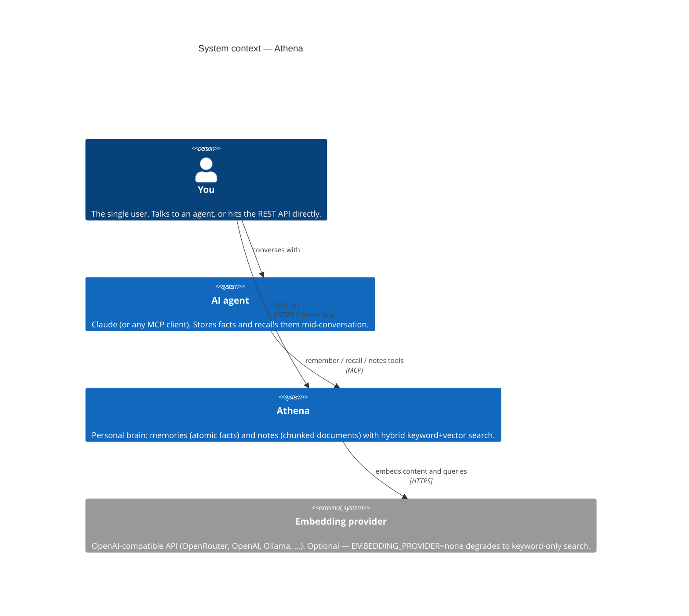
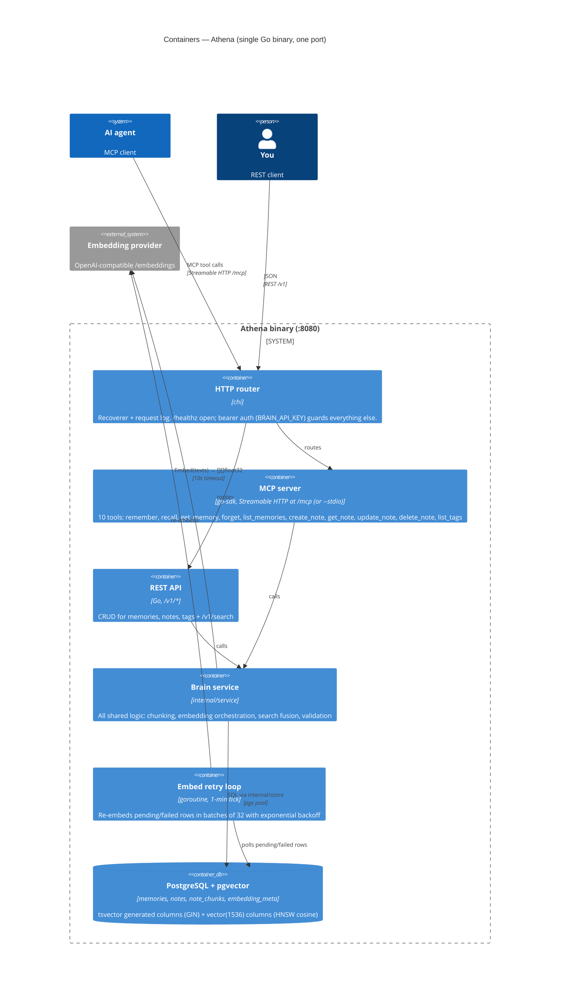
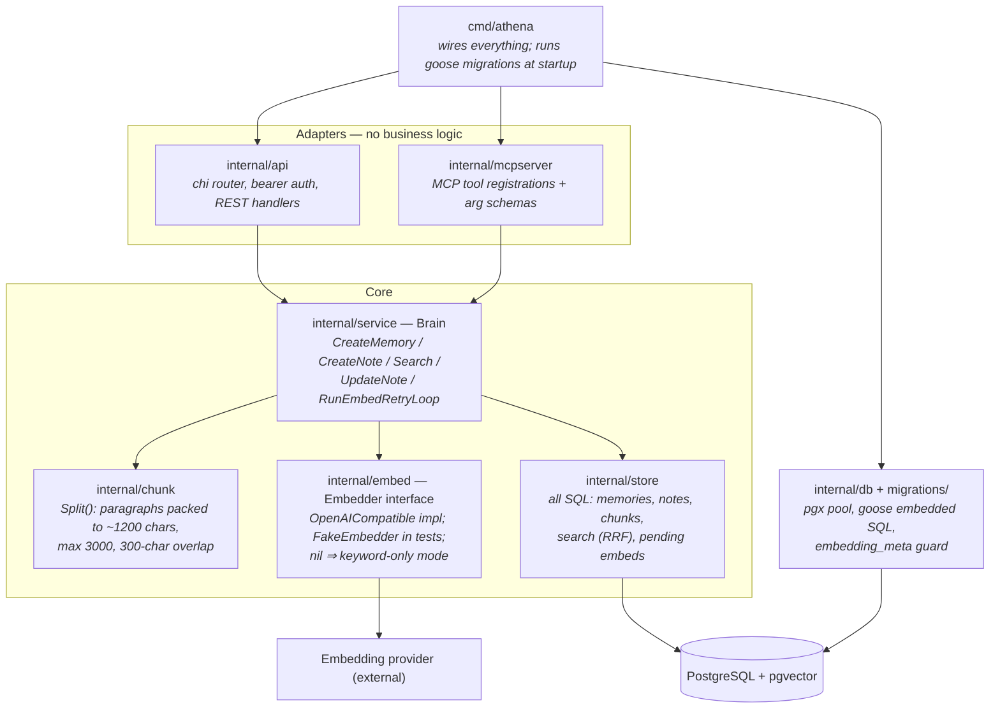
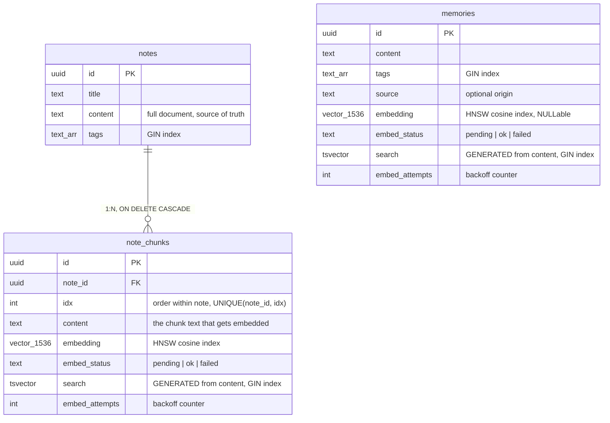
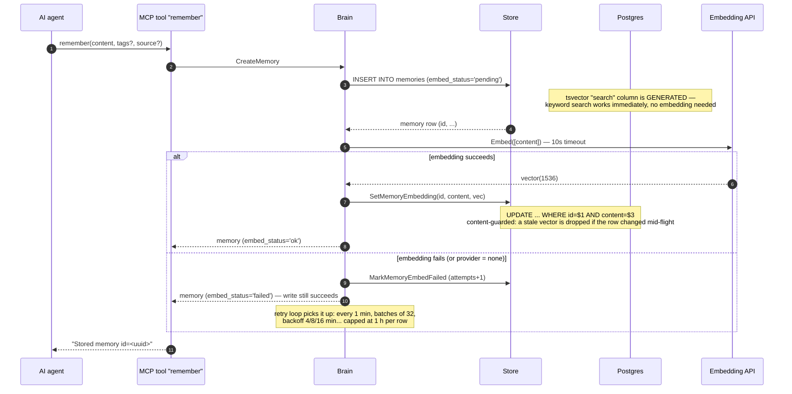
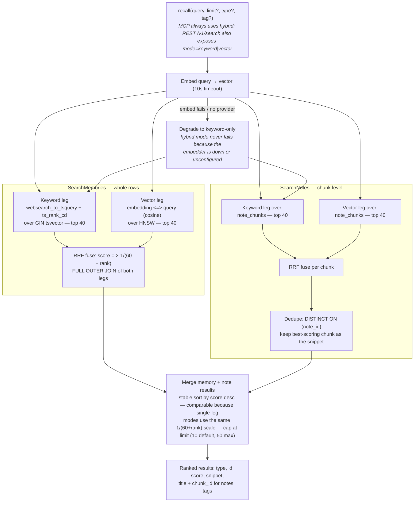

# Athena architecture (C4)

How an AI agent's tool call travels through the MCP server to Postgres, how
memories and notes are saved and referenced, and how search works. Diagrams
follow the [C4 model](https://c4model.com): context → containers → components,
then dynamic diagrams for the three flows that matter.

- [Level 1 — System context](#level-1--system-context)
- [Level 2 — Containers](#level-2--containers)
- [Level 3 — Components](#level-3--components-inside-the-binary)
- [Data model](#data-model)
- [Flow: saving a memory](#flow-saving-a-memory-remember)
- [Flow: saving a note](#flow-saving-a-note-create_note)
- [Flow: search](#flow-search-recall)
- [How things are referenced](#how-things-are-referenced)

## Level 1 — System context

Athena is a single-user "personal brain". Two kinds of clients talk to it: AI
agents over MCP, and anything else (scripts, curl, a future UI) over REST.
The only external dependency is an OpenAI-compatible embedding API — and it is
optional: without it Athena runs keyword-only.



## Level 2 — Containers

One Go binary, one port (default `:8080`). The MCP server is not a separate
process — it is mounted at `/mcp` behind the same bearer-auth middleware as
the REST API (or served over stdio with the `--stdio` flag). Both are thin
adapters over the same `Brain` service.



## Level 3 — Components (inside the binary)

Layering rule (from `CLAUDE.md`): handlers and tools are thin adapters, shared
logic lives in `internal/service`, SQL lives only in `internal/store`.



## Data model



Key asymmetry: **memories are indexed whole** (one row = one fact = one
embedding), while **notes are indexed by chunk** — the note row keeps the full
content for retrieval, but all searching happens against `note_chunks`.
A single-row `embedding_meta` table records provider/model/dimensions and is
checked at startup so vectors from a different model are never silently mixed.

## Flow: saving a memory (`remember`)

The core guarantee: **an embedding failure never fails a write.** The row is
persisted first; the embedding is best-effort with a background safety net.



`update` of a memory re-embeds only when the content actually changed.

## Flow: saving a note (`create_note`)

Notes go through the chunker first; note + chunks are inserted in **one
transaction**, then all chunks are embedded in **one batched API call**.

```mermaid
sequenceDiagram
    autonumber
    participant A as AI agent
    participant M as MCP tool "create_note"
    participant B as Brain
    participant C as chunk.Split
    participant S as Store
    participant P as Postgres
    participant E as Embedding API

    A->>M: create_note(title, content, tags?)
    M->>B: CreateNote
    B->>C: Split(content)
    C-->>B: chunks — split on blank lines, packed to ~1200 chars<br/>(hard max 3000), last ≤300 chars carried into next chunk as overlap
    B->>S: CreateNote(title, content, tags, chunks)
    S->>P: BEGIN — INSERT note; INSERT note_chunks(idx 0..n, 'pending'); COMMIT
    S-->>B: note + ChunkRefs
    B->>E: Embed([all chunk texts]) — one batched call
    alt batch succeeds
        B->>S: SetChunkEmbedding per chunk (content-guarded)
        B-->>M: note (embed_status='ok')
    else batch fails
        B->>S: MarkChunkEmbedFailed for each chunk
        B-->>M: note (embed_status='failed') — note is saved regardless
        Note over B: retry loop re-embeds; if a batch keeps failing it falls back<br/>to per-item so one poison chunk can't starve the rest
    end
    M-->>A: "Created note id=<uuid>"
```

`update_note` with new content **deletes and re-creates all chunks** in the
same transaction, then re-embeds them. A note's `embed_status` is an aggregate
over its chunks: `failed` if any failed, else `pending` if any pending, else `ok`.

## Flow: search (`recall`)

Hybrid search = keyword leg + vector leg, fused with Reciprocal Rank Fusion
(RRF). Memories and note chunks are searched separately, then merged on a
shared score scale.



Details worth knowing:

- **Tag filter** (`tag=` / `AND $n = ANY(tags)`) applies inside both legs, so
  the candidate pool is filtered before ranking, not after.
- **Rows without embeddings still surface** via the keyword leg (`FULL OUTER
  JOIN` in the fusion), so a just-written memory whose embedding is still
  pending is findable immediately.
- **Pure vector mode** errors if no embedder is configured; **hybrid** silently
  degrades to keyword. Keyword mode never touches the embedding API.

## How things are referenced

Search results are pointers, not payloads:

1. `recall` returns ranked results with `type` (`memory`/`note`), `id`,
   `score`, a one-line `snippet` (memory content, or the best-matching chunk),
   and for notes the `title` and `chunk_id`.
2. The agent follows the reference: `get_note(note_id)` fetches the full
   original content (never the chunks — the note row is the source of truth)
   and `get_memory(memory_id)` fetches a memory's full content, tags, and
   source; `update_note(note_id)` / `forget(memory_id)` mutate by id.
3. Deleting a note cascades to its chunks (`ON DELETE CASCADE`); deleting a
   memory is a single-row delete.
4. Tags are the cross-cutting reference: `list_tags` aggregates counts across
   memories and notes so agents reuse vocabulary instead of inventing it, and
   any list/search call can filter by tag.
